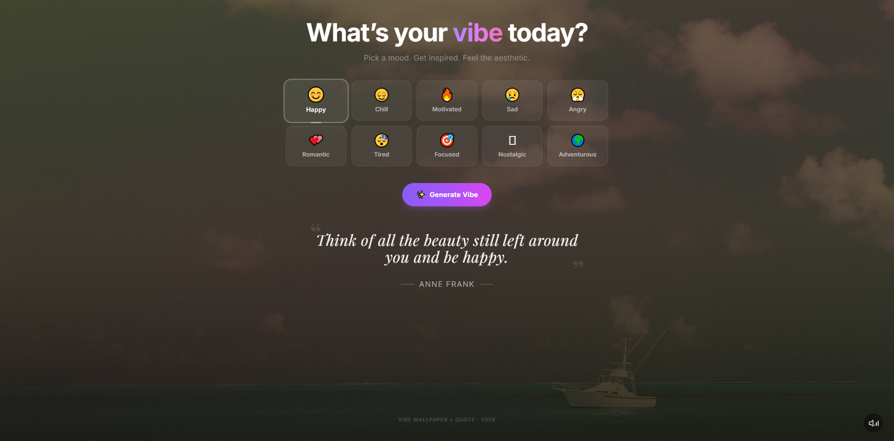
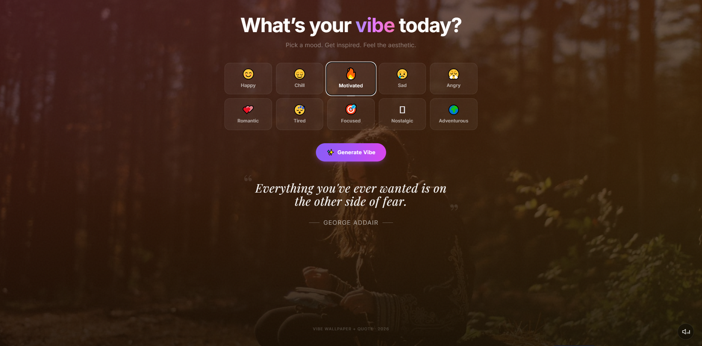
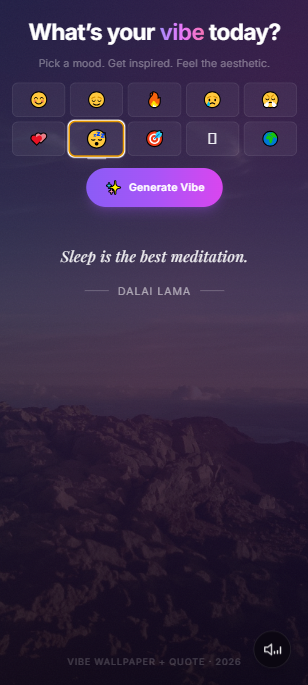

# VibeFlow

A cozy single-page web app that turns your current **mood** into an immersive experience:

- Beautiful background image matching your vibe  
- Fitting inspirational / funny / deep quote  
- Ambient background music that loops gently  

Perfect for setting as a browser homepage, quick mood reset, or just chilling.
## Screenshots

Here’s how VibeFlow looks in action:


*Default view: Choose your vibe*


*Motivated mood: Epic visuals & uplifting energy*


*Looks great on phones too!*

*(Music plays looped in the background – mute button bottom-right)*

## Features
- 10 moods to choose from: happy 😊 • chill 🧘 • motivated 💪 • sad 😔 • angry 😠 • romantic 💕 • tired 😴 • focused 🎯 • nostalgic 📼 • adventurous 🌍  
- Auto-generated high-quality backgrounds (local fallback possible)  
- Mood-matched quotes (from public API + smart filtering)  
- Two ambient music tracks per mood — random pick for variety  
- Mute/unmute control  
- Dark mode aesthetic, responsive, mobile-friendly  
- No login, no ads, fully local assets for music

## Live Demo
(coming soon – or add Netlify/Vercel link once deployed)

https://your-username.github.io/vibeflow/  
(or Vercel/Netlify preview link)

## Screenshots
(Add 2–3 screenshots here later – mood selector, happy vibe, sad vibe)

## Tech Stack
- React (Vite)  
- Tailwind CSS  
- TypeScript (optional)  
- Local MP3 assets for reliable music playback  
- Public quote API (type.fit)

## How to Run Locally

1. Clone the repo
   ```bash
   git clone https://github.com/yourusername/vibeflow.git
   cd vibeflow
   ```

2. Install dependencies
   ```bash
   npm install
   ```

3. Start development server
   ```bash
   npm run dev
   ```
   → Open http://localhost:5173

## How to Contribute
- Add new moods  
- Improve quote filtering  
- Add favorite/save feature  
- Particle effects / better animations  
- PWA support  
- Volume slider instead of just mute  

PRs welcome! Keep the vibe positive ✨

## License
MIT License – feel free to use, fork, remix.

Made with ❤️ in Rawalpindi
```

### Final Tips Before Publishing
- **Add a good README image/screenshot** at the top (use lightshot or browser screenshot → crop nicely)  
- **Create a simple favicon** (emoji 🌙 or 🎧 in favicon.io)  
- **Deploy it** for free: Vercel (easiest), Netlify, or GitHub Pages  
- **Add topics/tags** on GitHub: react, tailwindcss, vite, mood-tracker, ambient-music, aesthetic, web-app  
- **Star it yourself** and share on X / Reddit if you want feedback

What name/description combo are you leaning toward?  
Or want me to tweak the README more (e.g. add deployment steps, license badge, etc.)? 🚀
